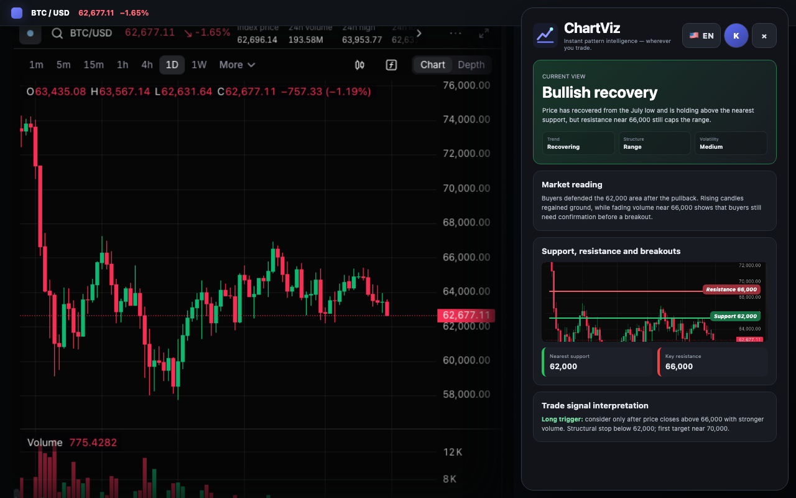
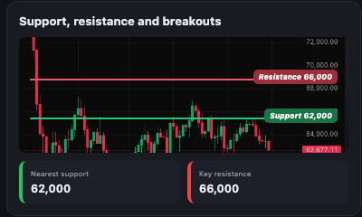
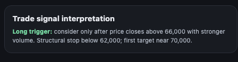

# ChartViz

ChartViz 1.0.15 is an open-source Chrome and Edge extension that helps people read candlestick charts. It detects a supported chart page, captures the visible chart, and presents evidence-based price-action analysis with separate annotated images. It is an educational chart-reading tool, not financial advice.

For the hosted ChartViz Cloud experience, visit [chartviz.xyz](https://www.chartviz.xyz).

The extension contains two explicit analysis modes:

- **ChartViz Cloud** is the default tab for a new installation. Create a revocable access token in ChartViz website Settings, paste it into the extension, and use the managed analysis service without placing a model-provider key in the extension.
- **Direct model** sends the captured chart from the browser to a user-selected OpenRouter or OpenAI model. Existing usable Direct configurations remain in Direct mode after an upgrade.

There is no bundled backend, account/login flow, analytics, report history, news search, exchange-data API, billing flow, or local-model runtime.

## Download and install

[**Download the latest ChartViz release**](https://github.com/ockevin331/chartviz-community/releases/latest)

Current v1.0.15 packages:

- [Download for Chrome](https://github.com/ockevin331/chartviz-community/releases/download/v1.0.15/chartviz-extension-v1.0.15-chrome.zip)
- [Download for Edge](https://github.com/ockevin331/chartviz-community/releases/download/v1.0.15/chartviz-extension-v1.0.15-edge.zip)

Unzip the downloaded package, then:

1. Open `chrome://extensions` in Chrome or `edge://extensions` in Edge.
2. Enable **Developer mode**.
3. Choose **Load unpacked**.
4. Select the unzipped directory that contains `manifest.json`.
5. Pin ChartViz and click its toolbar icon on a supported chart page.

No build tools are required when installing a release package. See [Development](#development) to build from source.

## What ChartViz shows you

### A readable market view

ChartViz turns a dense candlestick chart into a concise directional view, a plain-language market reading, and the chart evidence behind it. The original chart stays visible next to the result.



### Support, resistance, and breakouts

Key price areas are drawn directly on a separate annotated chart, with the nearest support and resistance repeated as readable price cards. This keeps level evidence easy to verify without modifying the source chart.



### Trade-signal interpretation

When the chart contains a usable signal, ChartViz explains the trigger, invalidation or stop area, and target context in plain language. Separate signal annotations prevent multiple plans from becoming one crowded image. The real BTCUSDT 15-minute result below marks a Long entry at 63,050, a stop at 62,790, and the first target at 63,300 on the analyzed chart.



ChartViz also explains visible chart patterns and indicator evidence. Every generated annotation can be opened at full size and downloaded.

## Supported chart sites

Open the example link, wait for the chart to finish loading, and then open ChartViz.

| Site | Example chart | Cloud multi-timeframe |
| --- | --- | :---: |
| TradingView | [BTC/USD chart](https://www.tradingview.com/chart/?symbol=BITSTAMP%3ABTCUSD) | Yes |
| Binance | [BTC/USDT spot](https://www.binance.com/en/trade/BTC_USDT?type=spot) | Yes |
| OKX | [BTC/USDT spot](https://www.okx.com/trade-spot/btc-usdt) | Yes |
| Bybit | [BTC/USDT](https://www.bybit.com/en/trade/usdt/BTCUSDT) | Yes |
| Hyperliquid | [BTC perpetual](https://app.hyperliquid.xyz/trade/BTC) | Yes |
| Coinbase | [BTC/USD advanced trade](https://www.coinbase.com/advanced-trade/spot/BTC-USD) | Yes |
| Bitget | [BTC/USDT spot](https://www.bitget.com/spot/BTCUSDT) | Yes |
| Gate | [BTC/USDT spot](https://www.gate.com/trade/BTC_USDT) | Yes |
| KuCoin | [BTC/USDT spot](https://www.kucoin.com/trade/BTC-USDT) | Yes |
| MEXC | [BTC/USDT spot](https://www.mexc.com/exchange/BTC_USDT) | Yes |
| HTX | [BTC/USDT spot](https://www.htx.com/trade/btc_usdt) | Yes |
| Upbit | [BTC/KRW](https://www.upbit.com/exchange?code=CRIX.UPBIT.KRW-BTC) | Yes |
| 同花顺 | [Ping An Bank](https://stockpage.10jqka.com.cn/000001/) | No — single timeframe only |
| VergeX | [BTC chart](https://vergex.trade/chart?symbol=BTC&exchange=3c1d0438-8a57-4a2e-ad90-68069c247367) | Yes |

## Analysis modes

### ChartViz Cloud

The Cloud tab connects to the fixed ChartViz Cloud service at `https://www.chartviz.xyz`. A revocable `cv_live_*` access token identifies the ChartViz account and lets the extension read account, plan, quota, model, and capture settings; submit analysis tasks; poll or cancel them; and render the validated result. Disconnecting removes the token from this extension only. Token creation and revocation remain on the website.

Multi-timeframe capture uses the ordered timeframes returned by the account's Cloud settings, up to three roles. The default fixture maps Context to `4h`, Setup to `1h`, and Trigger to `15m`. The chart may briefly flicker while ChartViz switches timeframes. A failed switch stops the sequence, attempts to restore the original timeframe, and submits no partial result. Sites can explicitly disable this capability; 同花顺 does.

### Direct model

Direct mode is single-timeframe only. Select a curated vision model grouped by OpenAI or Anthropic; optionally use OpenRouter; then enter a key issued by that service. Saving configuration makes no provider request. **Test connection** makes exactly one real request and may consume provider quota.

Each Direct analysis makes three sequential requests. The first two inspect the same screenshot from complementary chart-reading and trade-signal perspectives; the third receives normalized evidence instead of the image and prepares the validated report. A failed request stops immediately and is never retried silently. Direct mode rejects multiple captures before contacting a provider.

Keys and Direct settings are stored only in `browser.storage.session`. They are not written to local/sync storage, logs, reports, downloads, copied diagnostics, or page scripts. Fully quitting and restarting the browser clears the session key.

The curated catalog includes `openai/gpt-5.6-terra`, `openai/gpt-5.6-sol`, `openai/gpt-5.6-luna`, and Claude 5/4.5 variants. Only models in this catalog are supported; arbitrary model IDs and custom API origins are rejected.

## Capture and page guidance

Open a supported chart page, keep the chart visible, open ChartViz, and choose **Capture and analyze**. The panel hides only while the visible tab is captured and then restores. The extension does not read an exchange API.

See [Supported chart sites](#supported-chart-sites) for verified example URLs.

- A supported chart URL shows the detected instrument, exchange, and timeframe plus single/multi capture cards.
- A supported domain with an unsupported URL explains that the current page is not a chart page and links to one BTC chart example for that site.
- An unsupported domain links to [ChartViz](https://www.chartviz.xyz/) for website screenshot analysis and shows green links to supported sites. It does not place a file picker in the extension.
- On `chartviz.xyz`, the same link tells the user to use the screenshot upload area on the current page.

The original screenshot and generated annotation images can be zoomed and downloaded. Support/resistance, patterns, and each trade signal use separate annotations so multiple plans are not combined into one crowded signal image.

## Privacy and permissions

In Cloud mode, captured screenshots and task metadata are sent only to the fixed ChartViz Cloud service. In Direct mode, the screenshot is sent to the selected provider in the first two requests. The third request contains normalized chart evidence, requested output language, and the final reasoning prompt. The applicable service or provider retention, billing, and privacy terms apply. Avoid charts containing account details, personal data, or private indicators.

Manifest permissions include `activeTab`, `storage`, `scripting`, `clipboardWrite`, and `<all_urls>`. Broad host access allows a chart panel opened from a ChartViz navigation link to capture the currently visible tab without a second toolbar click. The extension captures only after the user starts an analysis; it does not take background screenshots. Clipboard access is used only when the user explicitly copies diagnostic information. There is no optional host access, remote executable code, or custom API origin. See [SECURITY.md](SECURITY.md) for the exact boundary and [docs/manual-smoke-test.md](docs/manual-smoke-test.md) for the release checklist.

## Troubleshooting

- **This page is not a supported chart page:** follow the displayed same-site BTC example, then reopen ChartViz.
- **Unable to detect the active chart:** wait until the chart and timeframe controls finish loading, then refresh chart detection.
- **Timeframe switch failed:** keep the chart tab visible and let the site finish loading before retrying.
- **`invalid_api_key`:** confirm the key belongs to the selected Direct provider and re-enter it after a browser restart.
- **`model_not_found` / `model_not_multimodal`:** choose another supported model from the built-in catalog.
- **`insufficient_balance` / `rate_limited`:** check the provider account's billing, quota, and limits.
- **`network_timeout`:** check connectivity and provider availability, then start a new explicit analysis.
- **`invalid_response`:** retry with a clear chart and a curated model; the result must match the Community report contract.

## Development

Requirements: Node.js 24, pnpm 11.20.0, and Git.

From a clean checkout, run the canonical release verification:

```bash
bash scripts/verify-release.sh
```

The generated unpacked directories are `extension/.output/chrome-mv3` and `extension/.output/edge-mv3`.

```bash
pnpm --dir extension install --frozen-lockfile
pnpm --dir extension test
pnpm --dir extension compile
pnpm --dir extension build
pnpm --dir extension build:edge
node --test tests/package-contents.test.mjs tests/release-docs.test.mjs
node scripts/verify-package.mjs extension/.output/chrome-mv3 extension/.output/edge-mv3
```

Packaging, signing, publishing, deployment, and GitHub releases are separate maintainer actions.
